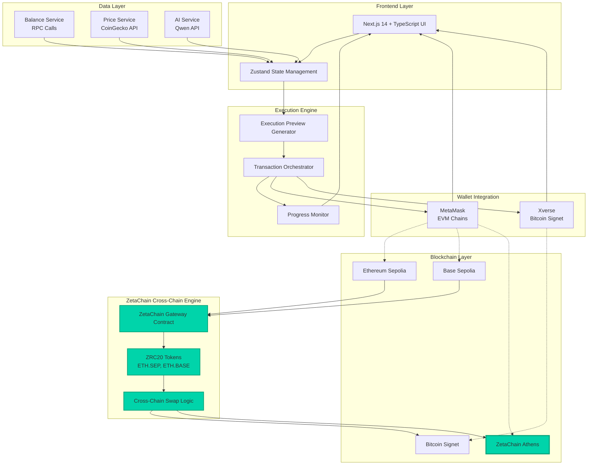
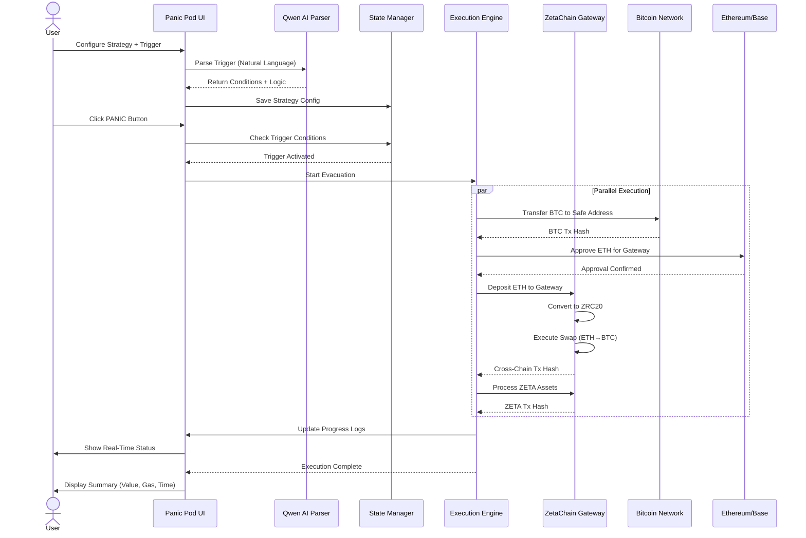

# 🚨 Panic Pod - Cross-Chain Emergency Evacuation System

<div align="center">

**One Click, All Chains, Safe Exit**

A Web3 emergency evacuation system powered by ZetaChain that enables instant cross-chain asset migration during market crashes or security threats.

[🎯 Live Demo](#) | [📺 Video Demo](#) | [📖 Documentation](#features)


</div>

---

## 🎯 Problem Statement

Crypto users face critical challenges during market volatility or security threats:
- **No unified emergency exit** across multiple chains (BTC, ETH L2s, etc.)
- **Time-consuming manual transfers** during critical moments
- **Complex cross-chain operations** requiring technical expertise
- **Missed opportunities** to execute conditional strategies based on market triggers

## 💡 Solution: Panic Pod

**Panic Pod** is a cross-chain emergency evacuation platform that leverages **ZetaChain's omnichain infrastructure** to enable:

✅ **One-click evacuation** of assets from Bitcoin, Ethereum L2s, and ZetaChain simultaneously
✅ **AI-powered trigger conditions** using natural language (Alibaba Qwen API)
✅ **Cross-chain asset swaps** via ZetaChain Gateway (ETH → BTC, etc.)
✅ **Real-time execution monitoring** with transparent transaction tracking
✅ **Dual-mode strategies**: Security Escape (immediate) + Safe Haven (conditional)

---

## 🏗️ Architecture



### Data Flow: Emergency Evacuation



---

## ✨ Key Features

### 🔐 Dual-Mode Emergency Strategy

| Mode | Use Case | Mechanism |
|------|----------|-----------|
| **Security Escape** | Immediate threat (hack, exploit) | Direct transfer of all assets to safe addresses |
| **Safe Haven** | Market crash protection | AI-triggered conditional execution based on price thresholds |

### 🤖 AI-Powered Trigger Configuration

Powered by **Alibaba Cloud Qwen API**, users can set evacuation triggers using natural language:

```
Input: "If ETH drops below $2000 or BTC drops below $40000"
Output: Structured conditions with AND/OR logic + asset-specific execution plans
```

### ⛓️ Multi-Chain Support

| Chain | Network | Purpose |
|-------|---------|---------|
| **Bitcoin Signet** | Testnet | BTC balance + transfers via Xverse |
| **Ethereum Sepolia** | Testnet | ETH balance + cross-chain swaps |
| **Base Sepolia** | Testnet | ETH balance + cross-chain swaps |
| **ZetaChain Athens** | Testnet | ZETA native + ZRC20 tokens (ETH.SEP, ETH.BASE) |

### 🌉 ZetaChain Integration

**Gateway Contracts:**
- Sepolia Gateway: `0x0000459991a4B9FDbbBE13574ab104cde53517e2`
- Base Sepolia Gateway: `0x00004ab9991a4B9FDbbBE13574ab104cde53517e2`

**Cross-Chain Swaps:**
- ETH (Sepolia) → ZRC20 (ETH.SEP) → BTC
- ETH (Base) → ZRC20 (ETH.BASE) → BTC
- Automated approval + deposit + swap flow

**ZRC20 Token Addresses:**
- `0x05BA149A7bd6dC1F937fA9046A9e05C05f3b18b0` (ETH.SEP)
- `0xd97B1de3619ed2c6BEb3860147E30cA8A7dC9891` (ETH.BASE)

### 📊 Real-Time Data Integration

- **Balance Fetching**: Live RPC calls to Bitcoin (mempool.space), Ethereum testnets, ZetaChain
- **Price Feeds**: Real-time BTC/ETH/ZETA prices via CoinGecko API (60s cache)
- **Transaction Monitoring**: Step-by-step progress tracking with tx hashes

---

## 🛠️ Tech Stack

### Frontend
- **Framework**: Next.js 14 (App Router)
- **Language**: TypeScript 5
- **UI Library**: React 18.3
- **Styling**: Tailwind CSS 3.4
- **Icons**: Lucide React
- **State**: Zustand 4.5

### Blockchain
- **EVM Interaction**: Ethers.js 6.16
- **Bitcoin Integration**: Xverse SDK
- **Wallets**: MetaMask (EVM) + Xverse (BTC)

### External APIs
- **AI Parsing**: Alibaba Cloud Qwen API
- **Price Data**: CoinGecko API
- **Bitcoin Data**: mempool.space API

---

## 🚀 Getting Started

### Prerequisites
- Node.js 18+ and npm
- MetaMask wallet (for EVM chains)
- Xverse wallet (for Bitcoin Signet)

### Installation

1. **Clone the repository:**
```bash
git clone https://github.com/yourusername/panic-pod.git
cd panic-pod
```

2. **Install dependencies:**
```bash
npm install
```

3. **Configure environment variables:**

Create a `.env.local` file:
```bash
NEXT_PUBLIC_QWEN_API_KEY=your_qwen_api_key_here
```

Get your Qwen API key from [Alibaba Cloud DashScope](https://dashscope.aliyun.com/)

4. **Run the development server:**
```bash
npm run dev
```

5. **Open [http://localhost:3000](http://localhost:3000)**

### Setup Testnet Wallets

**MetaMask:**
- Add Ethereum Sepolia, Base Sepolia, ZetaChain Athens networks
- Get testnet ETH from faucets:
  - [Sepolia Faucet](https://sepoliafaucet.com/)
  - [Base Sepolia Faucet](https://www.coinbase.com/faucets/base-ethereum-goerli-faucet)
  - [ZetaChain Faucet](https://labs.zetachain.com/get-zeta)

**Xverse:**
- Download [Xverse Wallet](https://www.xverse.app/)
- Switch to Bitcoin Signet testnet
- Get testnet BTC from [Signet Faucet](https://signetfaucet.com/)

---

## 📱 User Journey

### Step 1: Connect Wallets
<kbd>Landing Page</kbd> → Connect both MetaMask (EVM) + Xverse (Bitcoin) → Auto-redirect to Dashboard

### Step 2: Configure Strategy
<kbd>Dashboard</kbd> → "Configure Strategy" button → Set safe addresses + AI trigger conditions → Save

**Example Configuration:**
```yaml
Safe Addresses:
  BTC: bc1q... (required)
  EVM: 0x... (optional, defaults to USDC on ZetaChain)

AI Trigger:
  Input: "If ETH drops below $2000 or BTC drops below $40000"
  Parsed Conditions:
    - ETH price < $2000 OR BTC price < $40000
    - Logic: OR
    - Execution Plan:
      * BTC: Direct transfer to safe address
      * ETH (Sepolia): Swap to BTC via ZetaChain Gateway
      * ETH (Base): Swap to BTC via ZetaChain Gateway
      * ZETA: Convert to USDC
```

### Step 3: Execute Evacuation
<kbd>Dashboard</kbd> → "PANIC" button → Review execution preview → Confirm → Monitor real-time progress on Execute page

**Execution Preview:**
- Estimated gas fees per chain
- Total value to evacuate
- Warning for dust amounts (<$50 USD)
- Skip reasons for excluded assets

**Real-Time Monitoring:**
- Live status cards per chain (BTC, ETH, ZETA)
- Step-by-step progress: Pending → Processing → Success
- Detailed execution log with timestamps
- Transaction hashes for block explorer verification

---

## 📁 Project Structure

```
panic-pod/
├── app/                          # Next.js 14 App Router
│   ├── page.tsx                 # Landing page with wallet connection
│   ├── layout.tsx               # Root layout wrapper
│   ├── dashboard/               # Asset management dashboard
│   │   └── page.tsx
│   ├── execute/                 # Execution monitoring page
│   │   └── page.tsx
│   └── api/                     # API routes
│       └── parse-trigger/       # AI trigger parsing endpoint
│           └── route.ts
│
├── components/                   # React components
│   ├── ui/                      # Reusable UI (Button, Card, Modal, Input)
│   ├── dashboard/               # Dashboard components (AssetCard)
│   ├── execute/                 # Execution components (ChainExecutionCard, ExecutionLog)
│   └── layout/                  # Layout components (Navbar)
│
├── hooks/                        # Custom React hooks
│   ├── useWalletBalances.ts     # Fetch multi-chain balances
│   ├── usePrices.ts             # Fetch cryptocurrency prices
│   ├── useEvmWallet.ts          # MetaMask wallet integration
│   ├── useBitcoinWallet.ts      # Xverse wallet integration
│   └── useExecutionPreview.ts   # Generate execution previews
│
├── lib/                          # Core business logic
│   ├── balanceService.ts        # Balance fetching (Bitcoin, EVM, ZRC20)
│   ├── priceService.ts          # CoinGecko API price data
│   ├── qwenService.ts           # AI trigger parsing (Qwen API)
│   ├── zetachainService.ts      # ZetaChain integration
│   ├── evmService.ts            # EVM wallet utilities
│   ├── bitcoinService.ts        # Bitcoin utilities
│   ├── executionEngine.ts       # Transaction orchestrator
│   ├── gasEstimation.ts         # Gas fee estimation
│   └── transactions/            # Blockchain transaction modules
│       ├── btcTransaction.ts    # Bitcoin transfers via Xverse
│       ├── evmTransaction.ts    # EVM transfers via MetaMask
│       ├── zetaGateway.ts       # ZetaChain Gateway interactions
│       └── types.ts             # Shared transaction types
│
├── store/                        # Zustand state management
│   └── useStore.ts              # Global app state
│
├── config/                       # Configuration
│   └── chains.ts                # Chain configs (RPC, explorers, IDs)
│
└── types/                        # TypeScript type definitions
    ├── index.ts                 # Core types (Asset, Strategy, Execution)
    └── wallet.ts                # Wallet types (EVM, Bitcoin)
```

---

## 🎨 Design System

### Color Palette
```css
--danger-red: #ef4444;     /* Emergency/panic elements */
--safe-green: #22c55e;     /* Success/safe states */
--warning-amber: #f59e0b;  /* Processing/attention */
--pod-bg: #0a0a0f;         /* Main background */
--pod-surface: #131318;    /* Card backgrounds */
```

### Typography
- **Display (Orbitron)**: Headers, titles, numbers
- **Mono (IBM Plex Mono)**: Body text, data, addresses

### Visual Effects
- Scan lines and grid patterns (sci-fi HUD aesthetic)
- Glow effects on critical elements (PANIC button)
- Pulse animations (slow pulse, danger pulse)
- Glass morphism panels
- HUD corner decorations (hexagon borders)

---

## 🧪 Development Status

### ✅ Implemented
- [x] Real wallet balance fetching (Bitcoin, Ethereum testnets, ZetaChain)
- [x] Real-time price feeds (CoinGecko API)
- [x] AI trigger parsing (Qwen API)
- [x] Dual wallet integration (MetaMask + Xverse)
- [x] ZetaChain Gateway configuration
- [x] Gas estimation per chain
- [x] Execution preview generation
- [x] Manual balance refresh
- [x] Multi-chain network switching

### 🚧 In Progress
- [ ] Transaction signing and broadcasting
- [ ] ZetaChain smart contract deployment
- [ ] Cross-chain swap execution (ETH → BTC)
- [ ] Historical execution records
- [ ] Mobile responsive optimization

### 🔮 Future Enhancements
- [ ] Support for more chains (Polygon, Arbitrum, Optimism)
- [ ] Advanced trigger conditions (volume, liquidity, time-based)
- [ ] Portfolio rebalancing strategies
- [ ] Multi-signature safe address support
- [ ] Telegram/Discord notifications
- [ ] DCA (Dollar-Cost Averaging) mode

---

## 🔍 Code Highlights

### Cross-Chain Balance Fetching
```typescript
// lib/balanceService.ts
export async function fetchAllBalances(
  btcAddress?: string,
  evmAddress?: string
): Promise<WalletBalances> {
  const [btcBalance, ethSepoliaBalance, baseSepoliaBalance, zetaBalances] =
    await Promise.all([
      fetchBitcoinBalance(btcAddress),
      fetchEthereumBalance(evmAddress, ETHEREUM_SEPOLIA),
      fetchEthereumBalance(evmAddress, BASE_SEPOLIA),
      fetchZetaChainBalances(evmAddress),
    ]);
  // ...
}
```

### AI Trigger Parsing
```typescript
// lib/qwenService.ts
export async function parseTriggerConditions(userInput: string) {
  const response = await fetch('https://dashscope.aliyuncs.com/api/v1/services/aigc/text-generation/generation', {
    method: 'POST',
    headers: {
      'Authorization': `Bearer ${apiKey}`,
      'Content-Type': 'application/json',
    },
    body: JSON.stringify({
      model: 'qwen-plus',
      input: { messages: [{ role: 'user', content: prompt }] },
      parameters: { temperature: 0.1 },
    }),
  });
  // Returns structured conditions + logic + execution plan
}
```

### ZetaChain Gateway Integration
```typescript
// lib/zetachainService.ts
export async function estimateZetaSwap(
  fromChain: ChainType,
  amount: string
): Promise<string> {
  const zrc20Address = getZRC20Address(fromChain);
  const contract = new ethers.Contract(zrc20Address, ZRC20_ABI, provider);
  const [gasZRC20, gasFee] = await contract.withdrawGasFee();
  // Returns estimated output amount after fees
}
```

---

## 📊 Performance Metrics

- **Balance Fetch Time**: ~2-3 seconds (parallel RPC calls)
- **AI Parsing Time**: ~1-2 seconds (Qwen API)
- **Execution Preview Generation**: <500ms
- **Gas Estimation**: ~1 second per chain

---

## 🛡️ Security Considerations

⚠️ **Disclaimer**: This is a hackathon prototype. **DO NOT** use with real mainnet funds.

**Security Features:**
- Client-side wallet integration (no private key storage)
- Real-time gas estimation to prevent failed transactions
- Dust threshold ($50 USD) to avoid uneconomical transfers
- Transaction preview before execution
- Execution step validation

**Recommended Audits Before Mainnet:**
- Smart contract security audit (ZetaChain Gateway interactions)
- Front-end security review (XSS, CSRF protection)
- Private key handling audit
- Rate limiting for API endpoints
- Multi-signature support for safe addresses

---

## 🤝 Contributing

Contributions are welcome! Please follow these steps:

1. Fork the repository
2. Create a feature branch (`git checkout -b feature/amazing-feature`)
3. Commit your changes (`git commit -m 'Add amazing feature'`)
4. Push to the branch (`git push origin feature/amazing-feature`)
5. Open a Pull Request

---

## 📄 License

This project is licensed under the MIT License - see the [LICENSE](LICENSE) file for details.

---

## 🙏 Acknowledgments

- **ZetaChain Team** for the omnichain infrastructure and testnet support
- **Alibaba Cloud** for Qwen AI API access
- **CoinGecko** for real-time price data API
- **Xverse & MetaMask** for wallet SDK integrations

---

## 📞 Contact

**Project Maintainer**: [Your Name]
- GitHub: [@yourusername](https://github.com/yourusername)
- Twitter: [@yourhandle](https://twitter.com/yourhandle)
- Email: your.email@example.com

**Project Link**: [https://github.com/yourusername/panic-pod](https://github.com/yourusername/panic-pod)

---

<div align="center">

**Built with ❤️ for ZetaChain Hackathon**

[⬆ Back to Top](#-panic-pod---cross-chain-emergency-evacuation-system)

</div>
