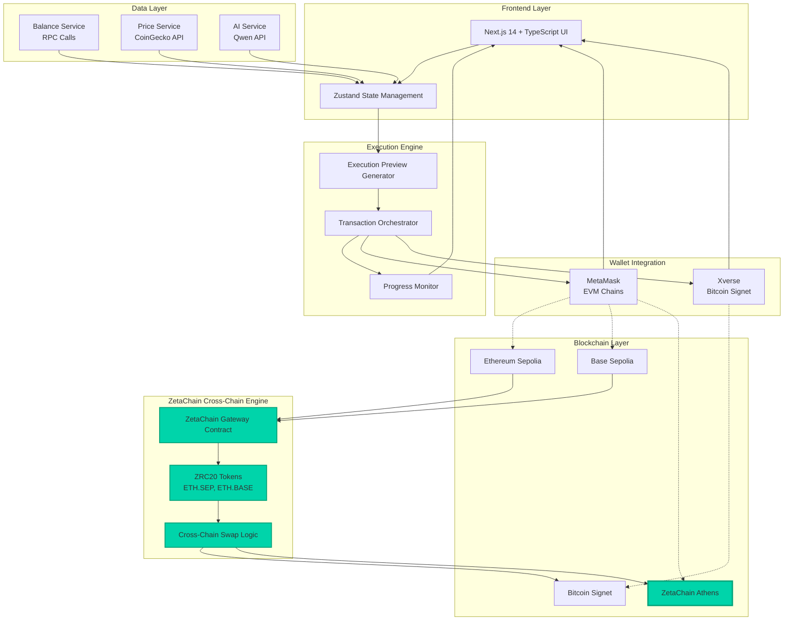
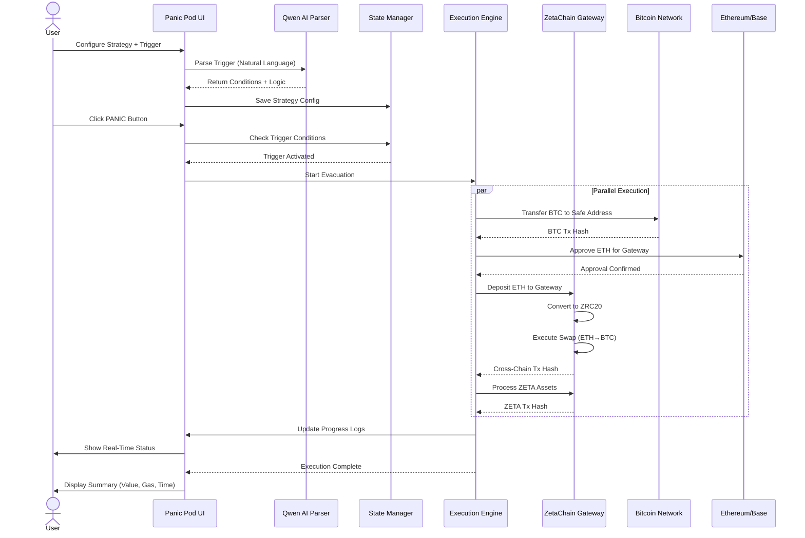

# 🚨 Panic Pod - 跨链紧急撤离系统

<div align="center">

**一键操作，全链撤离，安全退出**

基于 ZetaChain 的 Web3 紧急撤离系统，在市场崩盘或安全威胁时实现跨链资产即时迁移。

[📺 视频演示](https://www.youtube.com/watch?v=nOqq3oFGiz0)


</div>

---

## 🎯 问题陈述

加密货币用户在市场波动或安全威胁期间面临关键挑战：
- **多链缺乏统一紧急出口**（BTC、ETH L2 等）
- **关键时刻需要耗时的手动转账**
- **跨链操作复杂**，需要专业技术知识
- **错失机会**，无法基于市场触发条件执行策略

## 💡 解决方案：Panic Pod

**Panic Pod** 是一个跨链紧急撤离平台，利用 **ZetaChain 全链基础设施** 实现：

✅ **一键撤离** 同时从比特币、以太坊 L2 和 ZetaChain 转移资产
✅ **AI 驱动的触发条件**，使用自然语言（阿里云通义千问 API）
✅ **跨链资产兑换**，通过 ZetaChain Gateway（ETH → BTC 等）
✅ **实时执行监控**，透明的交易跟踪
✅ **双模式策略**：安全逃离（立即执行）+ 安全港湾（条件触发）

---

## 🏗️ Architecture



### Data Flow: Emergency Evacuation



---

## ✨ 核心功能

### 🔐 双模式紧急策略

| 模式 | 使用场景 | 机制 |
|------|----------|-----------|
| **安全逃离** | 即时威胁（黑客攻击、漏洞利用） | 将所有资产直接转移到安全地址 |
| **安全港湾** | 市场崩盘保护 | 基于价格阈值的 AI 触发条件执行 |

### 🤖 AI 驱动的触发配置

由 **阿里云通义千问 API** 提供支持，用户可以使用自然语言设置撤离触发条件：

```
输入: "如果 ETH 跌破 $2000 或 BTC 跌破 $40000"
输出: 带有 AND/OR 逻辑的结构化条件 + 资产特定执行计划
```

### ⛓️ 多链支持

| 链 | 网络 | 用途 |
|-------|---------|---------|
| **Bitcoin Signet** | 测试网 | BTC 余额 + 通过 Xverse 转账 |
| **Ethereum Sepolia** | 测试网 | ETH 余额 + 跨链兑换 |
| **Base Sepolia** | 测试网 | ETH 余额 + 跨链兑换 |
| **ZetaChain Athens** | 测试网 | ZETA 原生代币 + ZRC20 代币 (ETH.SEP, ETH.BASE) |

### 🌉 ZetaChain 集成

**Gateway 合约：**
- Sepolia Gateway: `0x0000459991a4B9FDbbBE13574ab104cde53517e2`
- Base Sepolia Gateway: `0x00004ab9991a4B9FDbbBE13574ab104cde53517e2`

**跨链兑换：**
- ETH (Sepolia) → ZRC20 (ETH.SEP) → BTC
- ETH (Base) → ZRC20 (ETH.BASE) → BTC
- 自动化授权 + 存入 + 兑换流程

**ZRC20 代币地址：**
- `0x05BA149A7bd6dC1F937fA9046A9e05C05f3b18b0` (ETH.SEP)
- `0xd97B1de3619ed2c6BEb3860147E30cA8A7dC9891` (ETH.BASE)

### 📊 实时数据集成

- **余额获取**：实时 RPC 调用比特币（mempool.space）、以太坊测试网、ZetaChain
- **价格源**：通过 CoinGecko API 实时获取 BTC/ETH/ZETA 价格（60秒缓存）
- **交易监控**：带有交易哈希的逐步进度跟踪

---

## 🛠️ 技术栈

### 前端
- **框架**: Next.js 14 (App Router)
- **语言**: TypeScript 5
- **UI 库**: React 18.3
- **样式**: Tailwind CSS 3.4
- **图标**: Lucide React
- **状态管理**: Zustand 4.5

### 区块链
- **EVM 交互**: Ethers.js 6.16
- **比特币集成**: Xverse SDK
- **钱包**: MetaMask (EVM) + Xverse (BTC)

### 外部 API
- **AI 解析**: 阿里云通义千问 API
- **价格数据**: CoinGecko API
- **比特币数据**: mempool.space API

---

## 🚀 快速开始

### 前置要求
- Node.js 18+ 和 npm
- MetaMask 钱包（用于 EVM 链）
- Xverse 钱包（用于 Bitcoin Signet）

### 安装步骤

1. **克隆仓库：**
```bash
git clone https://github.com/yourusername/panic-pod.git
cd panic-pod
```

2. **安装依赖：**
```bash
npm install
```

3. **配置环境变量：**

创建 `.env.local` 文件：
```bash
NEXT_PUBLIC_QWEN_API_KEY=your_qwen_api_key_here
```

从 [阿里云 DashScope](https://dashscope.aliyun.com/) 获取通义千问 API 密钥

4. **运行开发服务器：**
```bash
npm run dev
```

5. **打开 [http://localhost:3000](http://localhost:3000)**

### 设置测试网钱包

**MetaMask：**
- 添加 Ethereum Sepolia、Base Sepolia、ZetaChain Athens 网络
- 从水龙头获取测试网 ETH：
  - [Sepolia Faucet](https://sepoliafaucet.com/)
  - [Base Sepolia Faucet](https://www.coinbase.com/faucets/base-ethereum-goerli-faucet)
  - [ZetaChain Faucet](https://labs.zetachain.com/get-zeta)

**Xverse：**
- 下载 [Xverse Wallet](https://www.xverse.app/)
- 切换到 Bitcoin Signet 测试网
- 从 [Signet Faucet](https://signetfaucet.com/) 获取测试网 BTC

---

## 📱 用户流程

### 步骤 1：连接钱包
<kbd>首页</kbd> → 连接 MetaMask (EVM) + Xverse (Bitcoin) → 自动跳转到仪表盘

### 步骤 2：配置策略
<kbd>仪表盘</kbd> → "配置策略" 按钮 → 设置安全地址 + AI 触发条件 → 保存

**配置示例：**
```yaml
安全地址:
  BTC: bc1q... (必填)
  EVM: 0x... (可选，默认为 ZetaChain 上的 USDC)

AI 触发:
  输入: "如果 ETH 跌破 $2000 或 BTC 跌破 $40000"
  解析条件:
    - ETH 价格 < $2000 OR BTC 价格 < $40000
    - 逻辑: OR
    - 执行计划:
      * BTC: 直接转移到安全地址
      * ETH (Sepolia): 通过 ZetaChain Gateway 兑换为 BTC
      * ETH (Base): 通过 ZetaChain Gateway 兑换为 BTC
      * ZETA: 转换为 USDC
```

### 步骤 3：执行撤离
<kbd>仪表盘</kbd> → "PANIC" 按钮 → 查看执行预览 → 确认 → 在执行页面监控实时进度

**执行预览：**
- 每条链的预估 Gas 费用
- 待撤离资产总价值
- 小额资产警告（<$50 USD）
- 排除资产的原因

**实时监控：**
- 每条链的实时状态卡片（BTC、ETH、ZETA）
- 逐步进度：待处理 → 处理中 → 成功
- 带时间戳的详细执行日志
- 用于区块浏览器验证的交易哈希

---

## 📁 项目结构

```
panic-pod/
├── app/                          # Next.js 14 App Router
│   ├── page.tsx                 # 带钱包连接的首页
│   ├── layout.tsx               # 根布局包装器
│   ├── dashboard/               # 资产管理仪表盘
│   │   └── page.tsx
│   ├── execute/                 # 执行监控页面
│   │   └── page.tsx
│   └── api/                     # API 路由
│       └── parse-trigger/       # AI 触发解析端点
│           └── route.ts
│
├── components/                   # React 组件
│   ├── ui/                      # 可复用 UI (Button, Card, Modal, Input)
│   ├── dashboard/               # 仪表盘组件 (AssetCard)
│   ├── execute/                 # 执行组件 (ChainExecutionCard, ExecutionLog)
│   └── layout/                  # 布局组件 (Navbar)
│
├── hooks/                        # 自定义 React Hooks
│   ├── useWalletBalances.ts     # 获取多链余额
│   ├── usePrices.ts             # 获取加密货币价格
│   ├── useEvmWallet.ts          # MetaMask 钱包集成
│   ├── useBitcoinWallet.ts      # Xverse 钱包集成
│   └── useExecutionPreview.ts   # 生成执行预览
│
├── lib/                          # 核心业务逻辑
│   ├── balanceService.ts        # 余额获取 (Bitcoin, EVM, ZRC20)
│   ├── priceService.ts          # CoinGecko API 价格数据
│   ├── qwenService.ts           # AI 触发解析 (通义千问 API)
│   ├── zetachainService.ts      # ZetaChain 集成
│   ├── evmService.ts            # EVM 钱包工具
│   ├── bitcoinService.ts        # 比特币工具
│   ├── executionEngine.ts       # 交易编排器
│   ├── gasEstimation.ts         # Gas 费用估算
│   └── transactions/            # 区块链交易模块
│       ├── btcTransaction.ts    # 通过 Xverse 的比特币转账
│       ├── evmTransaction.ts    # 通过 MetaMask 的 EVM 转账
│       ├── zetaGateway.ts       # ZetaChain Gateway 交互
│       └── types.ts             # 共享交易类型
│
├── store/                        # Zustand 状态管理
│   └── useStore.ts              # 全局应用状态
│
├── config/                       # 配置
│   └── chains.ts                # 链配置 (RPC, 浏览器, ID)
│
└── types/                        # TypeScript 类型定义
    ├── index.ts                 # 核心类型 (Asset, Strategy, Execution)
    └── wallet.ts                # 钱包类型 (EVM, Bitcoin)
```

---

## 🎨 设计系统

### 调色板
```css
--danger-red: #ef4444;     /* 紧急/恐慌元素 */
--safe-green: #22c55e;     /* 成功/安全状态 */
--warning-amber: #f59e0b;  /* 处理中/注意 */
--pod-bg: #0a0a0f;         /* 主背景 */
--pod-surface: #131318;    /* 卡片背景 */
```

### 排版
- **显示字体 (Orbitron)**: 标题、数字
- **等宽字体 (IBM Plex Mono)**: 正文、数据、地址

### 视觉效果
- 扫描线和网格图案（科幻 HUD 美学）
- 关键元素发光效果（PANIC 按钮）
- 脉冲动画（慢脉冲、危险脉冲）
- 玻璃拟态面板
- HUD 角落装饰（六边形边框）

---

## 🧪 开发状态

### ✅ 已实现
- [x] 真实钱包余额获取（Bitcoin、以太坊测试网、ZetaChain）
- [x] 实时价格源（CoinGecko API）
- [x] AI 触发解析（通义千问 API）
- [x] 双钱包集成（MetaMask + Xverse）
- [x] ZetaChain Gateway 配置
- [x] 每条链的 Gas 估算
- [x] 执行预览生成
- [x] 手动余额刷新
- [x] 多链网络切换

### 🚧 进行中
- [ ] 交易签名和广播
- [ ] ZetaChain 智能合约部署
- [ ] 跨链兑换执行 (ETH → BTC)
- [ ] 历史执行记录
- [ ] 移动端响应式优化

### 🔮 未来增强
- [ ] 支持更多链（Polygon、Arbitrum、Optimism）
- [ ] 高级触发条件（交易量、流动性、时间基础）
- [ ] 投资组合再平衡策略
- [ ] 多签安全地址支持
- [ ] Telegram/Discord 通知
- [ ] DCA（定投）模式

---

## 🔍 代码亮点

### 跨链余额获取
```typescript
// lib/balanceService.ts
export async function fetchAllBalances(
  btcAddress?: string,
  evmAddress?: string
): Promise<WalletBalances> {
  const [btcBalance, ethSepoliaBalance, baseSepoliaBalance, zetaBalances] =
    await Promise.all([
      fetchBitcoinBalance(btcAddress),
      fetchEthereumBalance(evmAddress, ETHEREUM_SEPOLIA),
      fetchEthereumBalance(evmAddress, BASE_SEPOLIA),
      fetchZetaChainBalances(evmAddress),
    ]);
  // ...
}
```

### AI 触发解析
```typescript
// lib/qwenService.ts
export async function parseTriggerConditions(userInput: string) {
  const response = await fetch('https://dashscope.aliyuncs.com/api/v1/services/aigc/text-generation/generation', {
    method: 'POST',
    headers: {
      'Authorization': `Bearer ${apiKey}`,
      'Content-Type': 'application/json',
    },
    body: JSON.stringify({
      model: 'qwen-plus',
      input: { messages: [{ role: 'user', content: prompt }] },
      parameters: { temperature: 0.1 },
    }),
  });
  // 返回结构化条件 + 逻辑 + 执行计划
}
```

### ZetaChain Gateway 集成
```typescript
// lib/zetachainService.ts
export async function estimateZetaSwap(
  fromChain: ChainType,
  amount: string
): Promise<string> {
  const zrc20Address = getZRC20Address(fromChain);
  const contract = new ethers.Contract(zrc20Address, ZRC20_ABI, provider);
  const [gasZRC20, gasFee] = await contract.withdrawGasFee();
  // 返回扣除费用后的预估输出金额
}
```

---

## 📊 性能指标

- **余额获取时间**: ~2-3 秒（并行 RPC 调用）
- **AI 解析时间**: ~1-2 秒（通义千问 API）
- **执行预览生成**: <500ms
- **Gas 估算**: ~1 秒/链

---

## 🛡️ 安全考虑

⚠️ **免责声明**：这是一个黑客松原型项目。**请勿**使用真实主网资金。

**安全特性：**
- 客户端钱包集成（不存储私钥）
- 实时 Gas 估算防止交易失败
- 灰尘阈值（$50 USD）避免不经济的转账
- 执行前交易预览
- 执行步骤验证

**主网部署前建议审计：**
- 智能合约安全审计（ZetaChain Gateway 交互）
- 前端安全审查（XSS、CSRF 防护）
- 私钥处理审计
- API 端点速率限制
- 安全地址多签支持

---

## 🤝 贡献

欢迎贡献！请按以下步骤操作：

1. Fork 本仓库
2. 创建功能分支 (`git checkout -b feature/amazing-feature`)
3. 提交更改 (`git commit -m 'Add amazing feature'`)
4. 推送到分支 (`git push origin feature/amazing-feature`)
5. 开启 Pull Request

---

## 📄 许可证

本项目采用 MIT 许可证 

---

## 🙏 致谢

- **ZetaChain 团队**，提供全链基础设施和测试网支持
- **阿里云**，提供通义千问 AI API 访问
- **CoinGecko**，提供实时价格数据 API
- **Xverse & MetaMask**，提供钱包 SDK 集成

---

## 📞 联系方式

**项目维护者**: Lyris Zhen
- Email: lz20190201@gmail.com

**项目链接**: [https://github.com/yourusername/panic-pod]
---

<div align="center">

**为 ZetaChain 黑客松用 ❤️ 构建**

[⬆ 返回顶部](#-panic-pod---跨链紧急撤离系统)

</div>
